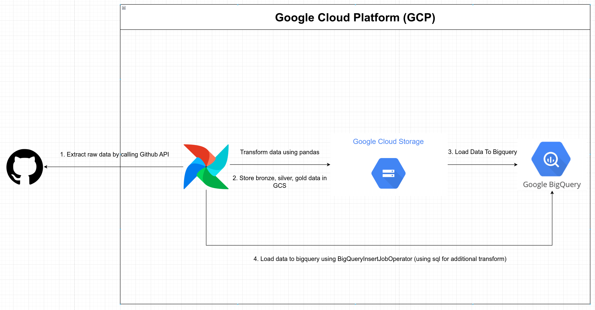
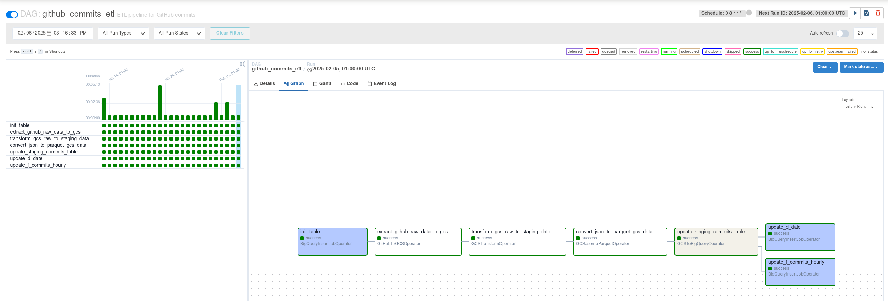
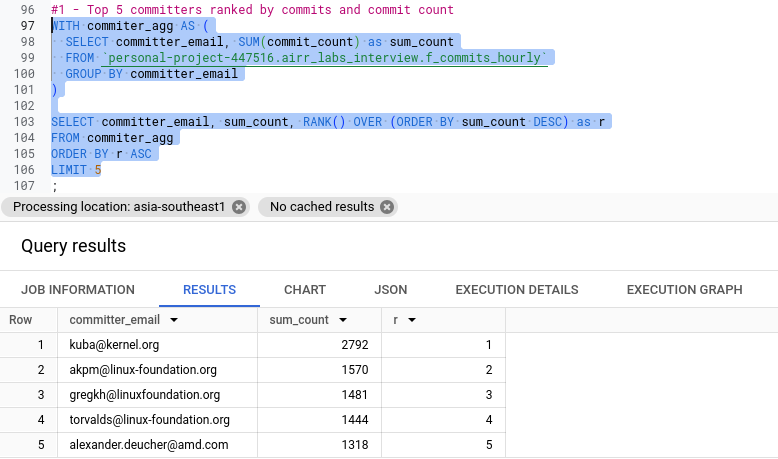
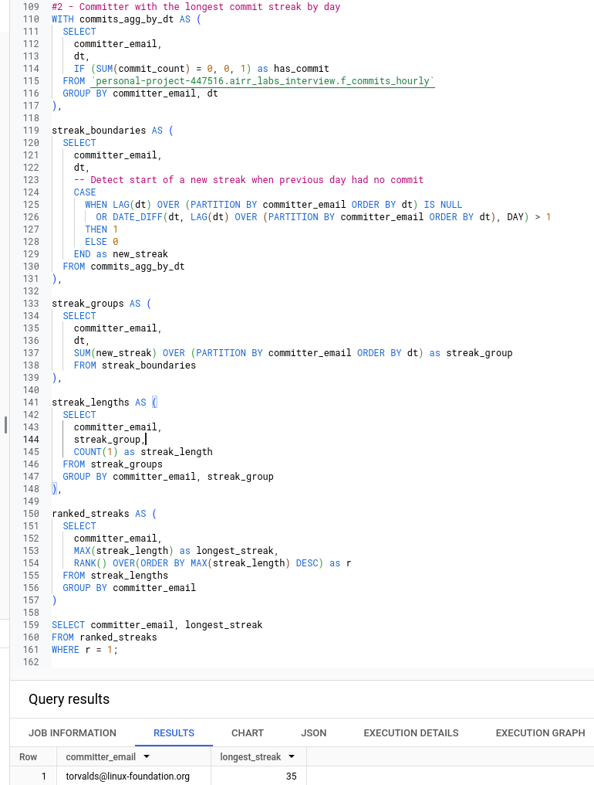
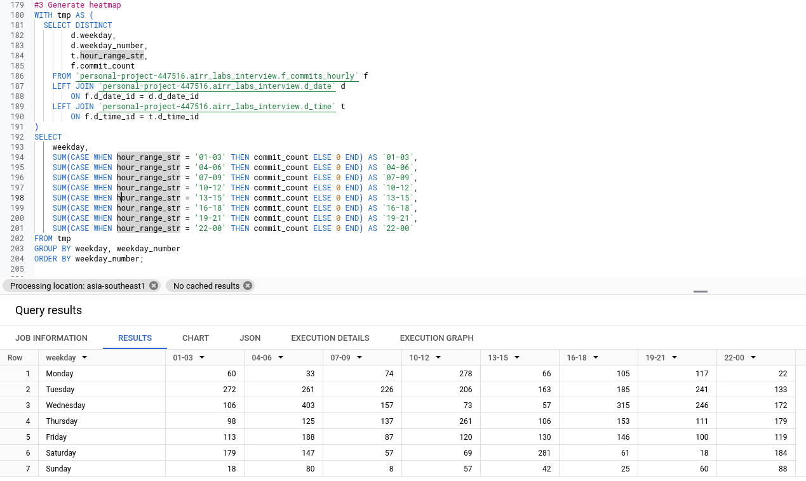

# GitHub API ETLT Pipeline

## Table of Contents
- [Overview](#overview)
- [Changelog](#changelog)
- [Infrastructure](#infrastructure)
- [Architecture](#architecture)
  - [Medallion Architecture](#medallion-architecture)
  - [Pipeline Architecture](#pipeline-architecture)
  - [Deployment Architecture](#deployment-architecture)
  - [Pipeline Components](#pipeline-components)
  - [Pipeline Design](#pipeline-design)
    - [Data Partitioning](#data-partitioning)
    - [Idempotency](#idempotency)
    - [Operation and Maintainability](#operation-and-maintainability)
- [Data Model](#data-model)
  - [Staging Layer](#-staging-layer)
  - [Dimension Tables](#-dimension-tables)
  - [Fact Table](#-fact-table)
  - [Key Features](#key-features)
- [Schedule](#schedule)
- [Setup](#setup)
- [CI/CD](#cicd)
- [Project Structure](#project-structure)
- [Data Analysis Results](#data-analysis-results)
  - [Top 5 Committers by Commit Count](#query-1-top-5-committers-by-commit-count)
  - [Committer with Longest Commit Streak](#query-2-committer-with-longest-commit-streak)
  - [Commit Activity Heatmap](#query-3-commit-activity-heatmap)
- [Development](#development)

## Overview
<details open>
<summary>Click to expand</summary>

An Apache Airflow pipeline that implements ETLT (Extract, Transform, Load, Transform), a variant of the traditional ETL pattern that adds a second transform phase after loading. This pipeline extracts commit data from the Apache Airflow GitHub repository and loads it into BigQuery using a medallion architecture.
</details>

## Changelog
<details open>
<summary>Click to expand</summary>

### February 2025
```
- Migrate Airflow deployment from Cloud Composer to GKE (reduce cost 8x times).
- Add Terraform configurations for automated provisioning kubernetes resources in GCP.
- Use sealed secret for store secret securely in git repo.
- Expose Airflow UI at https://airflow.dinhnn-poc.click/ with view-only access credentials.
```
</details>

## Infrastructure
<details open>
<summary>Click to expand</summary>

The infrastructure code for this project can be found at: https://github.com/nhudinh2103/airflow-infrastructure

This repository contains Terraform configurations for automated provisioning of infrastructure in Google Cloud Platform (GCP), including:
- Google Kubernetes Engine (GKE) cluster setup
- Apache Airflow deployment on GKE
- GitHub Actions self-hosted runners
- SealedSecret for secure secret management
- Network configurations and security settings
- And more infrastructure components

All infrastructure is managed as code using Terraform, enabling automated provisioning and consistent deployments across environments.
</details>

## Access Information
<details open>
<summary>Click to expand</summary>

- **Airflow URL**: https://airflow.dinhnn-poc.click/
- **Credentials**:
  - Username: airrlab_user
  - Password: airrlab_user
  - Note: This user has view-only access with limited permissions.
</details>

## Architecture

### Medallion Architecture
<details open>
<summary>Click to expand</summary>

The project organizes data into different layers of refinement, with all layers partitioned by day using hive format (dt=YYYY-MM-DD):

- **Bronze Layer**: Raw data from GitHub API stored as JSON files in GCS
- **Silver Layer**: Transformed data stored as JSON files in GCS
- **Gold Layer**: Final data stored as Parquet files in GCS before loading to BigQuery
</details>

### Pipeline Architecture
<details open>
<summary>Click to expand</summary>



The pipeline follows the ETLT (Extract, Transform, Load, Transform) pattern within Google Cloud Platform (GCP):

1. **Extract**: Raw data from GitHub API to Bronze layer
2. **Transform**: 
   - Normalize data and store in Silver layer
   - Convert to Parquet format in Gold layer
3. **Load**: Load Parquet data to BigQuery staging tables
4. **Transform**: Additional transformations using BigQueryInsertJob to create:
   - Dimension tables (e.g., date dimension)
   - Fact tables (e.g., hourly commits)
</details>

### Deployment Architecture
<details open>
<summary>Click to expand</summary>


The deployment process follows a CI/CD approach:
1. Data engineer commits code to GitHub repository
2. GitHub Actions triggers CI/CD job on new commits
3. On successful tests, code is deployed using Github Runners copy source to PVC (mounted from NFS VM) self hosted in GKE
4. Airflow scheduler pod automatically syncs code from GCS bucket
</details>

### Pipeline Components
<details open>
<summary>Click to expand</summary>


#### Airflow DAG


Tasks are organized to process data daily, with each execution handling its specific partition (dt=YYYY-MM-DD).

Tasks can run independently, with ability to run parallel for backfill when needed.

The Airflow DAG implements the ETLT pattern through these tasks:

1. **Extract**:
   - `init_table`: Initialize required tables
   - `extract_github_raw_data_to_gcs`: Extract data from GitHub API to Bronze layer

2. **First Transform**:
   - `transform_gcs_raw_to_staging_data`: Transform raw data to Silver layer
   - `convert_json_to_parquet_gcs_data`: Convert to Parquet format in Gold layer

3. **Load**:
   - `update_staging_commits_table`: Load data to BigQuery staging tables

4. **Second Transform**:
   - `update_d_date`: Create/update date dimension
   - `update_f_commits_hourly`: Create/update hourly commits fact table
</details>

### Pipeline Design
<details open>
<summary>Click to expand</summary>

The pipeline is designed with the following key principles:

#### Data Partitioning
- All data layers (Bronze, Silver, Gold) use hive-style partitioning by date (dt=YYYY-MM-DD)
- Each task operates on a daily partition basis
- This partitioning strategy enables:
  - Parallel processing of different date ranges
  - Easy reprocessing of specific time periods
  - Efficient data organization and retrieval
  - Consistent partition format across all layers

#### Idempotency
- All tasks are designed to be idempotent, guaranteeing consistent results across multiple runs
- Each rerun of a task for a specific partition will produce the same output
- This is achieved through:
  - Partition-based data overwriting: Each run completely replaces the data for its partition
  - Isolated partition processing: Operations on one day's data do not affect other days
  - Deterministic transformations: Same input always produces the same output

#### Operation and Maintainability
- **Data Backfilling Capabilities**
  + Pros:
    - Can rerun data independently by day if errors occur
    - Enables selective historical data reprocessing
  + Cons:
    - Can consume significant resources and time when running data for extended periods (1 year or more)
    - Requires careful resource planning for large-scale backfills
    - May impact current production workloads during extensive backfill operations
</details>

## Data Model
<details open>
<summary>Click to expand</summary>

The project implements a star schema design optimized for analyzing GitHub commit patterns:


### 🔄 Staging Layer
`staging_commits`
- Serves as the intermediate storage for transformed GitHub commit data
- Partitioned by date (dt=YYYY-MM-DD) for efficient data loading and historical analysis
- Key fields:
  - `commit_sha`: Unique identifier for each commit
  - `committer_id`, `committer_name`, `committer_email`: Committer details
  - `committer_date`: Raw string timestamp UTC (based on GitHub API response)
  - `dt`: Partition date (converted to GMT+7 for Vietnamese timezone)

### 📊 Dimension Tables

#### Time Dimension (`d_time`)
- Breaks down 24-hour periods into 3-hour ranges
- Enables time-based aggregation and analysis
- Fields:
  - `d_time_id`: Hour identifier (0-23)
  - `hour_range_str`: Human-readable time range (e.g., "01-03", "04-06")

#### Date Dimension (`d_date`)
- Stores calendar attributes for temporal analysis
- Fields:
  - `d_date_id`: Unique date identifier
  - `date_str`: String representation of date
  - `weekday`: Day of the week
  - `dt`: Date value

### 📈 Fact Table

`f_commits_hourly`
- Central table for commit activity analysis
- Granularity: Hourly commits per committer
- Uses `committer_email` as a reliable identifier
  > **Why email instead of ID?** GitHub API may return null values for `committer_id` in repository commits. Email addresses provide a more reliable way to track commit activity.
- Key metrics:
  - All date and time related columns are in GMT+7 timezone (for Vietnamese users)
  - `commit_count`: Number of commits in the time period
  - Partitioned by date (dt=YYYY-MM-DD) for optimal query performance

### Key Features
- ✨ Optimized star schema for commit analysis
- 📅 Date-based partitioning across tables
- 🔗 Maintained referential integrity through foreign keys
- 📧 Reliable committer tracking using email addresses
</details>

## Schedule
<details open>
<summary>Click to expand</summary>

- Runs daily
- Processes data for the previous day
- Idempotent execution
</details>

## Setup
<details open>
<summary>Click to expand</summary>

1. Set up GKE cluster using the infrastructure code from the infrastructure repository
2. Deploy Airflow on GKE using Helm chart
3. Configure Airflow variables using SealedSecret:
   ```
   github_token: Your GitHub API token
   ```
4. Update `config.py` with your:
   - GCS bucket
   - BigQuery project and dataset
   - Other configurations
</details>

## CI/CD
<details open>
<summary>Click to expand</summary>

The pipeline uses GitHub Actions for continuous integration and deployment:

1. Required Secrets:
   ```
   AIRR_LABS_GIHUB_TOKEN: GitHub token for container registry access
   AIRR_LABS_GCP_SA_KEY: GCP service account key
   AIRR_LABS_GCP_PROJECT_ID: GCP project ID
   ```

2. Workflow Steps:
   - On push/PR to main branch:
     - Runs tests in custom Docker container
     - If tests pass, authenticates with GCP
     - Syncs DAGs, SQL, and plugins to Airflow's PVC mounted from NFS VM
</details>

## Project Structure
<details open>
<summary>Click to expand</summary>

```
.
├── src/
│   ├── dags/
│   │   ├── dag_github_commits_etl.py    # Main DAG file
│   │   └── config/
│   │       └── config.py                # Configuration
│   ├── plugins/
│   │   ├── gcs.py                       # GCS utilities
│   │   ├── operators/
│   │   │   ├── github_to_gcs.py        # Bronze layer operator
│   │   │   ├── gcs_json_to_parquet.py  # Parquet conversion operator
│   │   │   └── gcs_transform.py        # GCS transformation operator
│   │   └── utils/
│   │       └── time_utils.py           # Time utility functions
│   └── sql/
│       ├── init_table.sql              # Table initialization
│       ├── merge_d_date.sql            # Date dimension merge
│       ├── merge_f_commits_hourly.sql  # Commits fact table merge
│       └── query/                      # Analysis queries
│           ├── 1-top-5-committers.sql
│           ├── 2-committer-longest-streak-by-day.sql
│           └── 3-generate-heat-map.sql
├── docker-build/                    # Docker build configurations
│   ├── Dockerfile
│   ├── build.sh
│   └── push-ghcr-github.sh
├── requirements.txt                 # Python dependencies
```
</details>

## Data Analysis Results
<details open>
<summary>Click to expand</summary>

The following analysis was performed on commit data collected from the Linux kernel repository (https://github.com/torvalds/linux) over a 6-month period from August 2024 to February 2025.

The analysis addresses three specific requirements using SQL queries:

### Query 1: Top 5 Committers by Commit Count

This query determines the top 5 committers ranked by count of commits and their number of commits:

1. kuba@kernel.org (2,792 commits)
2. akpm@linux-foundation.org (1,570 commits)
3. gregkh@linuxfoundation.org (1,481 commits)
4. torvalds@linux-foundation.org (1,444 commits)
5. alexander.deucher@amd.com (1,318 commits)

[View SQL Query](src/sql/query/1-top-5-committers.sql)



### Query 2: Committer with Longest Commit Streak

This query identifies the committer with the longest consecutive days of commits:

Linus Torvalds (torvalds@linux-foundation.org) achieved the longest streak with 35 consecutive days of commits.

[View SQL Query](src/sql/query/2-committer-longest-streak-by-day.sql)



### Query 3: Commit Activity Heatmap

This query generates a heatmap showing the distribution of commits by day of the week and 3-hour time blocks:

[View SQL Query](src/sql/query/3-generate-heat-map.sql?)

The visualization below shows the commit patterns across:
- Days of the week (Monday through Sunday)
- Time blocks (24-hour day divided into 3-hour ranges)


</details>

## Development
<details open>
<summary>Click to expand</summary>

> **Note**: Local Airflow development environment setup is work in progress. Currently using GKE - if you're interested in accessing the environment, please contact me and provide your details for VPN access setup.
</details>

## Improvements

Future improvements planned for this project:

- [x] Migrate Airflow deployment from Cloud Composer to GKE (for reduce costs as well as giving flexibility for multi-cloud deployment)-
- [x] Add Terraform configurations for automated provisioning of Kubernetes resources in GCP
- [ ] Replace SealedSecret with HashiCorp Vault for enhanced secret management capabilities
- [ ] Implement VPN-based access control to enhance security by restricting Airflow access to VPN users only
- [ ] (Optional) Use GitHub events for real-time streaming ETL Pipeline (Note: GitHub events have 5-minute delay)
